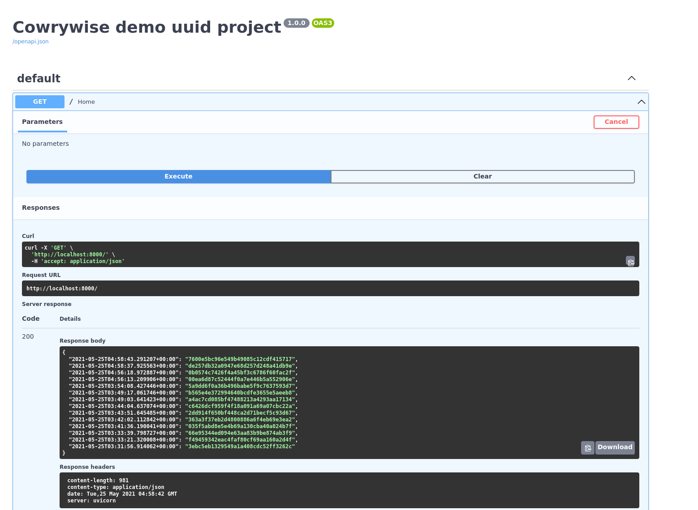

# cowrywise-uuid

Cowrywise-uuid a simple API that will return a key-value pair of randomly generated UUID. Key will be a timestamp and value will be UUID. While the server is running, whenever the API is called, it should return all the previous UUIDs ever generated by the API alongside a new UUID. Push the code to a git repository and share the link to the repo





### Built With
* [Flake8](https://fastapi.tiangolo.com/)
* [Docker](https://www.docker.com/)
* [Postgres](https://www.postgresql.org/)


<!-- GETTING STARTED -->
## Getting Started

Every great project has a beginning, Follow the step below to create your recipe instance otherwise click [Get started with docker](https://www.docker.com/get-started) to install docker. Navigate to the directory you would link to run the app and follow the steps below: 


1. Clone the repo
   ```sh
   git clone https://github.com/swilltec/cowrywise-uuid
   ```
2. Create a .env environment file. Copy the values of entries below from .env.template to .env file
    - POSTGRES_USER
    - POSTGRES_PASSWORD
    - POSTGRES_SERVER
    - POSTGRES_PORT
    - POSTGRES_DB

3. Enter the command below to start docker
  ```sh
  docker-compose up --build
  ```

